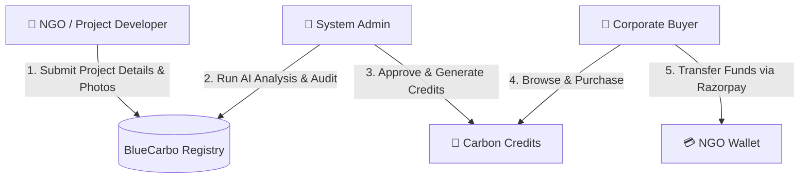

# 🌊 BlueCarbo: Government-Grade Blue Carbon Credit Registry & Marketplace

[](https://vite.dev/)
[](https://react.dev/)
[](https://tailwindcss.com/)
[](https://nodejs.org/)
[](https://www.mongodb.com/)
[](https://supabase.com/)

> **Empowering coastal ecosystems through transparent, AI-verified carbon financing. Bridging local conservation efforts with global corporate action.**

---

## 🌎 The Vision & The Problem We Are Solving

### The Critical Role of "Blue Carbon"
**Blue Carbon** is the carbon captured by the world's ocean and coastal ecosystems. Coastal wetlands—such as **mangroves, seagrass beds, and salt marshes**—sequester carbon at rates up to **10 times faster** per hectare than terrestrial tropical rainforests. They are the planet's most potent carbon sinks and provide critical defense against coastal erosion, storm surges, and biodiversity loss.

### The Problem
Despite their immense ecological value, coastal ecosystems are disappearing at an alarming rate. Global carbon markets want to fund restoration, but face massive bottlenecks:
1. **Lack of Transparency & Double Counting:** Buyers struggle to verify if a carbon credit represents a real, unique metric ton of sequestered carbon.
2. **The Verification Gap:** Traditional Measurement, Reporting, and Verification (MRV) is slow, manual, expensive, and prone to manipulation.
3. **Liquidity & Trust Issues:** Local communities (NGOs) doing the restoration work have difficulty accessing global capital, while corporate sponsors fear greenwashing accusations.

### The BlueCarbo Solution
**BlueCarbo** is a secure, decentralized, and government-grade digital registry and marketplace. It automates the verification of marine-based carbon credits by leveraging **AI-powered Ground & Satellite Image Analysis**, and securely bridges local NGOs with global corporate partners to facilitate instant, trustless carbon offset transactions.

---

## 🛠️ Tech Stack & Platform Architecture

BlueCarbo is built as a high-performance monorepo utilizing a modern JavaScript/Node.js stack:

### Frontend (`/Bluecarbo`)
* **Core:** React 19 (Hooks, Context API for authentication)
* **Build Tool:** Vite 7 (Hot Module Replacement, high-performance bundling)
* **Styling:** Tailwind CSS v4.0 (Custom design system, glassmorphism, responsive grids)
* **Navigation:** React Router v7
* **Icons:** Lucide React

### Backend (`/backend`)
* **Runtime:** Node.js & Express.js (v5.x for modern routing and asynchronous handler support)
* **Database:** MongoDB & Mongoose (Object Data Modeling)
* **Identity & Authentication:** Supabase Auth (bridged for secure sign-ups, password hashing, and token verification)
* **Payments:** Razorpay API Integration (for secure, real-time credit purchases and funding)
* **AI Analysis Engine:** Simulated satellite computer-vision analyzing Leaf Density, NDVI metrics, and geolocation coordinates.

---

## 👥 Platform Roles & Workflows

BlueCarbo connects three main user segments through a role-based dashboard layout:



### 1. 🌿 NGOs (Project Owners)
Local environmental agencies and coastal communities:
* **Register & Onboard:** Sign up with verified credentials.
* **Submit Projects:** List restoration sites (e.g., mangrove plantation, seagrass restoration) with location coordinates, plant counts, and ground/satellite photographs.
* **Earn Credits:** Once their project is audited and approved, carbon credits are automatically generated and assigned to their portfolio.
* **Secure Wallet:** Receive direct financial compensation into their digital wallets when corporates purchase their credits.

### 2. 🏢 Corporates (Sponsors/Buyers)
Businesses looking to meet net-zero carbon goals:
* **Interactive Marketplace:** Browse approved, high-impact blue carbon projects.
* **Buy Credits:** Purchase credits directly from NGOs via a secure payment gateway integration (Razorpay).
* **Portfolio Tracking:** Monitor purchase history, carbon metric tons offset, and project impact certificates in real time.

### 3. 👑 System Administrators (Auditors)
Verification and platform integrity specialists:
* **Review Pending Projects:** Assess submissions from NGOs.
* **Run AI Satellite Audit:** Trigger the integrated AI service to verify photo authenticity, calculate vegetation density, and estimate carbon yield.
* **Credit Minting:** Approve or reject projects. Approval automatically mints the corresponding carbon credits.
* **Financial Tracking:** View aggregate platform metrics, total carbon sequestered, active partners, and transaction histories.

---

## 🧪 Scientific MRV Calculation Engine

To ensure rigorous standardisation, BlueCarbo implements a digital **Measurement, Reporting, and Verification (MRV)** calculator:

$$\text{Carbon Credits Generated} = \text{Unit Count} \times \text{Ecosystem Factor}$$

Where **1 Carbon Credit = 1 Metric Ton of $\text{CO}_2$ sequestered**.

* **Mangroves:** Factor of **$1.0$** (Highly dense root and leaf systems).
* **Coastal Wetlands/Wetland Protection:** Factor of **$2.0$** (Deep soil carbon sequestration).
* **Ocean/Kelp Plantations:** Factor of **$0.5$** (Fast-growing marine vegetation).

---

## 🤖 The AI Verification Service
When an administrator triggers an audit, the system performs a multi-spectral image analysis:
* **Leaf Density (Pneumatophores & Canopy):** Estimates species health and growth stage.
* **NDVI Index Calculation:** Evaluates red and near-infrared reflectance to determine live green vegetation presence.
* **Geo-location Integrity:** Cross-references file metadata against reported coordinates to verify actual project existence.

---

## 📂 Project Directory Structure

```text
BlueCarbo/
├── Bluecarbo/                # Frontend Project (React + Vite)
│   ├── public/               # Static assets & videos
│   └── src/
│       ├── components/       # Common UI elements & layout templates
│       ├── context/          # AuthState & user sessions
│       ├── pages/            # Role-specific dashboard pages (NGO, Corporate, Admin)
│       └── services/         # API clients (Axios configurations)
│
├── backend/                  # Backend Server (Node + Express)
│   └── src/
│       ├── config/           # Database & Supabase connection setup
│       ├── controllers/      # Route handlers (auth, project, payment, credits)
│       ├── models/           # Mongoose schemas (User, Project, CarbonCredit)
│       ├── routes/           # Express API endpoints
│       └── services/         # AI analysis and external integrations
```

---

## 🚀 Running the Project Locally

### Prerequisites
* **Node.js** (v18 or higher recommended)
* **MongoDB** (running locally or an Atlas cluster connection)
* **Supabase** Project (for Auth credentials)

### 1. Environment Variables Configuration

#### Backend Setup (`/backend/.env`)
Create a `.env` file in the `backend` directory:
```env
PORT=5000
MONGO_URI=mongodb://127.0.0.1:27017/mydb
SUPABASE_URL=your-supabase-project-url
SUPABASE_ANON_KEY=your-supabase-anon-key
RAZORPAY_KEY_ID=your-razorpay-test-key
RAZORPAY_KEY_SECRET=your-razorpay-test-secret
```

#### Frontend Setup (`/Bluecarbo/.env`)
Create a `.env` file in the `Bluecarbo` directory:
```env
VITE_API_URL=http://localhost:5000/api
```

### 2. Start the Backend Server
```bash
cd backend
npm install
npm run dev
```
The server will boot on `http://localhost:5000`. It will automatically watch for changes and hot-reload.

### 3. Start the Frontend Application
```bash
cd Bluecarbo
npm install
npm run dev
```
The Vite development server will launch on `http://localhost:5173`. Open this URL in your browser to experience the platform.

---

## 📄 License
This project is licensed under the ISC License. 

*Designed with ❤️ for coastal ecosystem protection and carbon credit transparency.*
